# CI/CD パイプライン

以下のように CI パイプラインと CD パイプラインを定義する

| パイプライン名  | 定義                                                                                          |
| --------------- | --------------------------------------------------------------------------------------------- |
| CI パイプライン | 各ブランチでビルドとテストが成功することを確認する                                            |
| CD パイプライン | main ブランチでビルドとテストが成功した後、Artifact Registry へコンテナイメージをプッシュする |

## CI パイプライン

`GitHub Actions`を使ってコンテナイメージをビルドし、テストを実施する。  
`main`ブランチ以外の作業ブランチにてプッシュがされるたびに実行される。

## CD パイプライン

`GitHub Actions`を使ってコンテナイメージをビルドし、テストを実施する。  
テストに合格した場合、ビルドしたコンテナイメージを Google Cloud の`Artifact Registry`へプッシュする。

### 参考

- GitHub Actions から GCP にアクセスするために、Workload Identity 連携を利用している。(\*1)
  - \*1 [Workload Identity 連携を利用して GitHub Actions を動かす](https://zenn.dev/cloud_ace/articles/7fe428ac4f25c8)
- CD パイプラインでイメージをプッシュした後、Kubernetes のイメージも変更できるように検討中。
